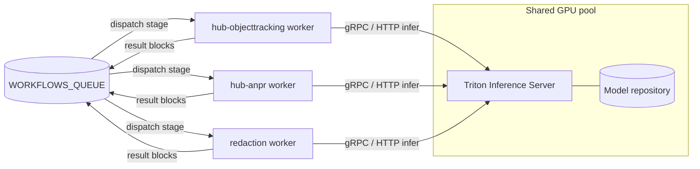

# triton

NVIDIA Triton Inference Server deployment — the central, shared, multi-model GPU
inference backend for the media pipeline.

## Overview

This repository deploys [NVIDIA Triton Inference Server](https://github.com/triton-inference-server/server)
into our Kubernetes clusters as the **central, shared, multi-model inference
backend** for the media pipeline.

Instead of every GPU-hungry pipeline stage bundling and loading its own model on
its own GPU, **one** Triton service hosts **many** models on a shared GPU pool.
The `hub-workflows` stage workers become thin inference **clients** that talk to
Triton over HTTP (`:8000`) or gRPC (`:8001`) using the KServe v2 protocol.

The guiding idea is to **decouple inference from orchestration**: workers keep all
of their queue, media and result-block logic, but delegate the actual model
execution to Triton.

> **Status:** new / near-empty repo. It currently contains only this README
> (the design/usage doc). Manifests, the model repository and export scripts are
> planned — see [Repository layout](#repository-layout) below.

## Architecture



Thin CPU-only workers scale independently on queue depth; only the small Triton
fleet is scheduled onto GPUs.

## How Triton works

- **Model repository** — a directory laid out as
  `<model>/<version>/<model-file>` plus a per-model `config.pbtxt`. It lives on a
  persistent volume or object storage (S3 / MinIO / GCS) and is passed via
  `--model-repository=<path-or-s3-uri>`. This is the single source of truth for
  what Triton serves.
- **Backends** — TensorRT (`platform: tensorrt_plan`, `model.plan`), ONNX Runtime
  (`backend: onnxruntime`, `model.onnx`), PyTorch / LibTorch, TensorFlow,
  OpenVINO, Python (arbitrary pre/post-processing) and DALI (GPU decode/resize).
  Multiple backends run side by side in one server.
- **Dynamic batching** — each model has a scheduler with
  `dynamic_batching { preferred_batch_size, max_queue_delay_microseconds }` that
  coalesces bursts of single requests into GPU batches, transparently to the
  caller.
- **Instance groups** — `instance_group [{ kind: KIND_GPU, count: N }]` runs `N`
  concurrent copies of a model, optionally pinned to specific GPUs (or
  `KIND_CPU`). Models execute concurrently via CUDA streams.
- **Ensembles** — `platform: "ensemble"` with `ensemble_scheduling.step[]` chains
  models (for example, `anpr = plate-detect -> plate-ocr`) in a single client
  call, keeping intermediate tensors on the GPU. Business Logic Scripting (BLS)
  covers logic-driven chaining.
- **Endpoints** — HTTP/REST on `:8000`, gRPC on `:8001`, and Prometheus metrics on
  `:8002/metrics`. Health at `/v2/health/ready` and `/v2/health/live`; inference
  at `POST /v2/models/<name>/infer`.
- **Model control modes** — `none` (eager-load every model at boot) or `explicit`
  (load/unload at runtime through the model-management API, enabling hot model
  rollouts with no server restart).

## Relation to hub-workflows

`hub-workflows` is a workflow engine that dispatches **stages** onto queues. Each
stage is a standalone, queue-driven worker (its own pod/deployment) that fetches
the recording via a signed URL, runs its work, and publishes result blocks
(detection / marker) back to `WORKFLOWS_QUEUE`.

Today the vision workers **embed** their own model and runtime (ONNX Runtime,
YOLOv8, tesseract, OpenCV). With Triton they keep all queue / media / block logic
but **replace the embedded model call with a Triton infer request** — becoming
thin clients with no GPU of their own. The Triton endpoint is injected via config
(e.g. `TRITON_URL`), just like the queue and storage endpoints already are.

Illustrative stage → model mapping:

| Stage                       | Triton model(s)                        |
| --------------------------- | -------------------------------------- |
| `hub-objecttracking`        | `yolov8-detect`, `reid-embed`          |
| `hub-anpr`                  | `plate-detect`, `plate-ocr` (or the `anpr` ensemble) |
| analysis / data-filtering   | `yolov8-detect`                        |
| redaction                   | `face-detect` (+ `plate-detect`)       |

The concrete model set is whatever the model repository in this repo ships.

**Example sequence** (ANPR stage):

```
queue dispatch
  -> worker GET media (signed URL)
  -> decode frame(s)
  -> gRPC Infer(plate-detect) -> boxes
  -> gRPC Infer(plate-ocr)    -> text
  -> publish DETECTION + MARKER blocks to the engine
```

## Why a shared Triton backend

Compared with running one GPU per pod/stage:

- **Utilisation** — bursty per-pod GPUs sit mostly idle; Triton packs many models
  onto shared GPUs for high, steady utilisation.
- **Cost** — GPU count scales with *total* load, not with the number of vision
  stages.
- **Scaling** — stage pods scale cheaply on CPU; only the small Triton fleet
  scales on GPU.
- **Memory** — weights are loaded once and reused by all callers, instead of being
  reloaded per replica.
- **Throughput** — dynamic batching plus concurrent model execution.
- **Model updates** — drop a new version into the model repository (hot-load)
  instead of rebuilding and redeploying every worker image.
- **Consistency** — one multi-framework serving layer with uniform Prometheus
  inference metrics.

## Repository layout

Planned structure (only `README.md` exists today):

```
model-repository/   models + config.pbtxt (source of truth)
deploy/             k8s manifests / Helm chart / Kustomize overlays
models/             model export & TensorRT conversion scripts/notes
README.md           this design/usage doc
```

## Deployment

Planned deployment shape:

- A Triton `Deployment`/`StatefulSet` using image
  `nvcr.io/nvidia/tritonserver:<tag>` with command
  `tritonserver --model-repository=<path-or-s3-uri>`.
- **GPU scheduling** — request the `nvidia.com/gpu` resource with the NVIDIA
  device plugin / GPU Operator on GPU nodes, plus `nodeSelector`/`tolerations`.
  Use MIG or time-slicing to share a physical GPU.
- **Model repository** — served from a persistent volume or
  `s3://<bucket>/model-repository` (the stack already runs MinIO).
- **Service** — exposes `8000` / `8001` / `8002`; readiness and liveness probes on
  `/v2/health/ready` and `/v2/health/live`.
- **Autoscaling** — HPA/KEDA on Triton's Prometheus metrics (queue time / GPU
  utilisation) for the Triton fleet; workers scale independently on CPU / queue
  depth.
