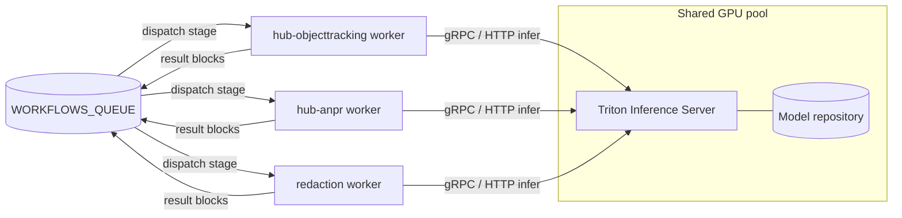

# triton

NVIDIA Triton Inference Server deployment — the central, shared, multi-model GPU
inference backend for the media pipeline.

## Overview

This repository deploys [NVIDIA Triton Inference Server](https://github.com/triton-inference-server/server)
into our Kubernetes clusters as the **central, shared, multi-model inference
backend** for the media pipeline.

Instead of every GPU-hungry pipeline stage bundling and loading its own model on
its own GPU, **one** Triton service hosts **many** models on a shared GPU pool.
The `hub-workflows` stage workers become thin inference **clients** that talk to
Triton over HTTP (`:8000`) or gRPC (`:8001`) using the KServe v2 protocol.

The guiding idea is to **decouple inference from orchestration**: workers keep all
of their queue, media and result-block logic, but delegate the actual model
execution to Triton.

> **Status:** early-stage repo. It ships this design doc, the standard CI/CD
> workflows, Kubernetes deployment manifests ([`deploy/`](deploy)), an example
> [`model-repository/`](model-repository) (YOLOv8 + YOLO26), model export scripts
> ([`models/`](models)) and a Go client SDK ([`clients/go/`](clients/go)). The
> model **weights** are not committed — they are generated by the export scripts
> (see [Example models](#example-models)).

## Architecture



Thin CPU-only workers scale independently on queue depth; only the small Triton
fleet is scheduled onto GPUs.

## How Triton works

- **Model repository** — a directory laid out as
  `<model>/<version>/<model-file>` plus a per-model `config.pbtxt`. It lives on a
  persistent volume or object storage (S3 / MinIO / GCS) and is passed via
  `--model-repository=<path-or-s3-uri>`. This is the single source of truth for
  what Triton serves.
- **Backends** — TensorRT (`platform: tensorrt_plan`, `model.plan`), ONNX Runtime
  (`backend: onnxruntime`, `model.onnx`), PyTorch / LibTorch, TensorFlow,
  OpenVINO, Python (arbitrary pre/post-processing) and DALI (GPU decode/resize).
  Multiple backends run side by side in one server.
- **Dynamic batching** — each model has a scheduler with
  `dynamic_batching { preferred_batch_size, max_queue_delay_microseconds }` that
  coalesces bursts of single requests into GPU batches, transparently to the
  caller.
- **Instance groups** — `instance_group [{ kind: KIND_GPU, count: N }]` runs `N`
  concurrent copies of a model, optionally pinned to specific GPUs (or
  `KIND_CPU`). Models execute concurrently via CUDA streams.
- **Ensembles** — `platform: "ensemble"` with `ensemble_scheduling.step[]` chains
  models (for example, `anpr = plate-detect -> plate-ocr`) in a single client
  call, keeping intermediate tensors on the GPU. Business Logic Scripting (BLS)
  covers logic-driven chaining.
- **Endpoints** — HTTP/REST on `:8000`, gRPC on `:8001`, and Prometheus metrics on
  `:8002/metrics`. Health at `/v2/health/ready` and `/v2/health/live`; inference
  at `POST /v2/models/<name>/infer`.
- **Model control modes** — `none` (eager-load every model at boot) or `explicit`
  (load/unload at runtime through the model-management API, enabling hot model
  rollouts with no server restart).

## Relation to hub-workflows

`hub-workflows` is a workflow engine that dispatches **stages** onto queues. Each
stage is a standalone, queue-driven worker (its own pod/deployment) that fetches
the recording via a signed URL, runs its work, and publishes result blocks
(detection / marker) back to `WORKFLOWS_QUEUE`.

Today the vision workers **embed** their own model and runtime (ONNX Runtime,
YOLOv8, tesseract, OpenCV). With Triton they keep all queue / media / block logic
but **replace the embedded model call with a Triton infer request** — becoming
thin clients with no GPU of their own. The Triton endpoint is injected via config
(e.g. `TRITON_URL`), just like the queue and storage endpoints already are.

Illustrative stage → model mapping:

| Stage                       | Triton model(s)                        |
| --------------------------- | -------------------------------------- |
| `hub-objecttracking`        | `yolov8-detect`, `reid-embed`          |
| `hub-anpr`                  | `plate-detect`, `plate-ocr` (or the `anpr` ensemble) |
| analysis / data-filtering   | `yolov8-detect`                        |
| redaction                   | `face-detect` (+ `plate-detect`)       |

The concrete model set is whatever the model repository in this repo ships.

**Example sequence** (ANPR stage):

```
queue dispatch
  -> worker GET media (signed URL)
  -> decode frame(s)
  -> gRPC Infer(plate-detect) -> boxes
  -> gRPC Infer(plate-ocr)    -> text
  -> publish DETECTION + MARKER blocks to the engine
```

## Why a shared Triton backend

Compared with running one GPU per pod/stage:

- **Utilisation** — bursty per-pod GPUs sit mostly idle; Triton packs many models
  onto shared GPUs for high, steady utilisation.
- **Cost** — GPU count scales with *total* load, not with the number of vision
  stages.
- **Scaling** — stage pods scale cheaply on CPU; only the small Triton fleet
  scales on GPU.
- **Memory** — weights are loaded once and reused by all callers, instead of being
  reloaded per replica.
- **Throughput** — dynamic batching plus concurrent model execution.
- **Model updates** — drop a new version into the model repository (hot-load)
  instead of rebuilding and redeploying every worker image.
- **Consistency** — one multi-framework serving layer with uniform Prometheus
  inference metrics.

## Repository layout

```
deploy/             Kubernetes manifests (Kustomize base) for the Triton server
model-repository/   models + config.pbtxt (source of truth for what Triton serves)
  yolov8/           example YOLOv8 detector (raw output, client-side NMS)
  yolo26/           example YOLO26 detector (end-to-end, NMS-free)
models/             model export & TensorRT conversion scripts + COCO labels
clients/go/         dependency-free Go client + object detector (KServe v2)
.github/workflows/  CI/CD (build, security scan, release, ...)
README.md           this design/usage doc
```

Model weights (`*.onnx` / `*.plan`) are git-ignored and reproduced with the
export scripts — see [Example models](#example-models).

## Deployment

The [`deploy/`](deploy) directory is a Kustomize base. Preview or apply it with:

```bash
kubectl kustomize deploy/          # render
kubectl apply -k deploy/           # apply to the cluster
```

It creates the `triton` namespace and:

- **`deployment.yaml`** — the Triton server (image
  `nvcr.io/nvidia/tritonserver:<tag>`, `--model-repository=/models`,
  `--model-control-mode=poll`). GPU scheduling via the `nvidia.com/gpu` resource;
  `nodeSelector`/`tolerations`/`runtimeClassName` for GPU nodes are included
  commented out. Health probes hit `/v2/health/ready` and `/v2/health/live`, and
  `/dev/shm` is backed by an in-memory volume (Triton needs more than the 64Mi
  default).
- **`service.yaml`** — ClusterIP exposing HTTP `8000`, gRPC `8001`, metrics `8002`.
- **`pvc.yaml`** — a PVC for the model repository (or switch Triton to
  `s3://<bucket>/model-repository`; the stack already runs MinIO).
- **`hpa.yaml`** — autoscales the fleet on Triton's queue-time metric (needs a
  ReadWriteMany PVC or an S3 model repository to run more than one replica).

The base has **no CRD dependencies**, so it applies on any cluster. Prometheus
scraping is opt-in because it needs the Prometheus Operator CRDs — apply the
monitoring overlay **in addition to** the base once those CRDs are installed:

```bash
kubectl apply -k deploy/monitoring/   # adds a ServiceMonitor for :8002/metrics
```

Keeping it separate is why `kubectl apply -k deploy/` no longer fails with
`no matches for kind "ServiceMonitor"` on clusters without the operator.

## Example models

Two example detectors ship in [`model-repository/`](model-repository):

| Model    | Backend     | Output               | Post-processing   |
| -------- | ----------- | -------------------- | ----------------- |
| `yolov8` | onnxruntime | `[84, 8400]` (raw)   | client-side NMS   |
| `yolo26` | onnxruntime | `[300, 6]` (end2end) | none (NMS-free)   |

The `config.pbtxt` files are committed; the weights are not. Generate them with
the export scripts:

```bash
cd models
pip install -r requirements.txt
python export_yolov8.py   # -> model-repository/yolov8/1/model.onnx
python export_yolo26.py   # -> model-repository/yolo26/1/model.onnx
```

After exporting, confirm the tensor names/shapes in each `config.pbtxt` match the
ONNX file (`polygraphy inspect model <path>`), since a different image size,
opset or class count will change them. See [`models/README.md`](models/README.md)
for TensorRT conversion notes.

## Consuming from workers (Go client)

[`clients/go/`](clients/go) is a dependency-free Go SDK that lets a worker move
its model **out of its own image** and call this shared backend instead. It
speaks Triton's KServe v2 REST protocol and ships a YOLO object detector for the
models above.

The key piece is an env-selected toggle that makes the baked-in model optional:

```go
import triton "github.com/uug-ai/triton/clients/go"

det, useTriton, err := triton.DetectorFromEnv() // Triton when TRITON_URL is set
if err != nil {
    return err
}
if !useTriton {
    det = myEmbeddedDetector() // fall back to the model built into the image
}
boxes, err := det.Detect(ctx, frame) // []triton.Detection in source-image pixels
```

Because the Triton path is pure Go (no `onnxruntime`/OpenCV/`-tags onnx`), the
default static worker image can do GPU inference just by pointing `TRITON_URL` at
the server. This mirrors the existing pluggable-engine seam in `hub-anpr`
(`plate.Recognizer` / `plate.Localizer`, selected by env with the embedded ONNX
behind a build tag) — the Triton detector slots in as one more adapter, keeping
the embedded model as a fallback. See [`clients/go/README.md`](clients/go/README.md).

This also shrinks the worker image: with inference offloaded to Triton, the
service needs no Python/ONNX/OpenCV and can ship as a static `CGO_ENABLED=0`
binary on `distroless/static` or `scratch` — near-zero OS CVE surface compared to
a Python ML base image. See [`cmd/triton-detect`](clients/go/cmd/triton-detect)
and its [Dockerfile](clients/go/cmd/triton-detect/Dockerfile) for a worked example.
